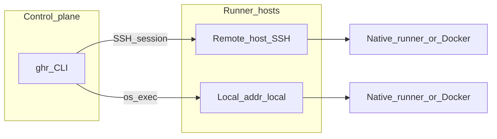
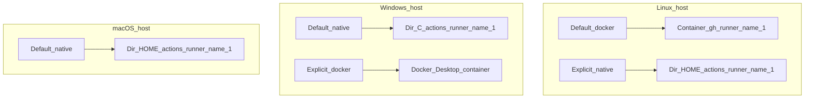
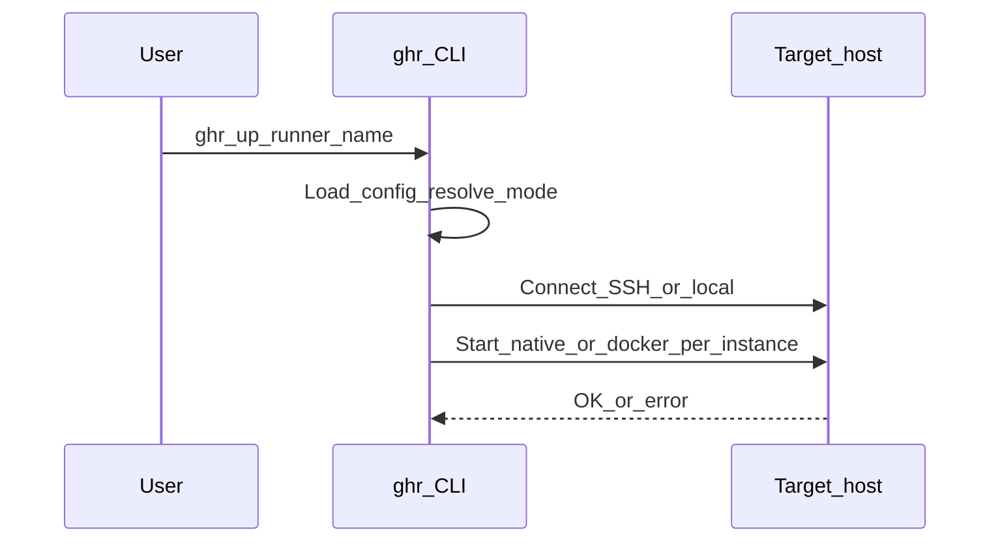
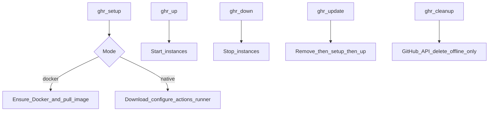
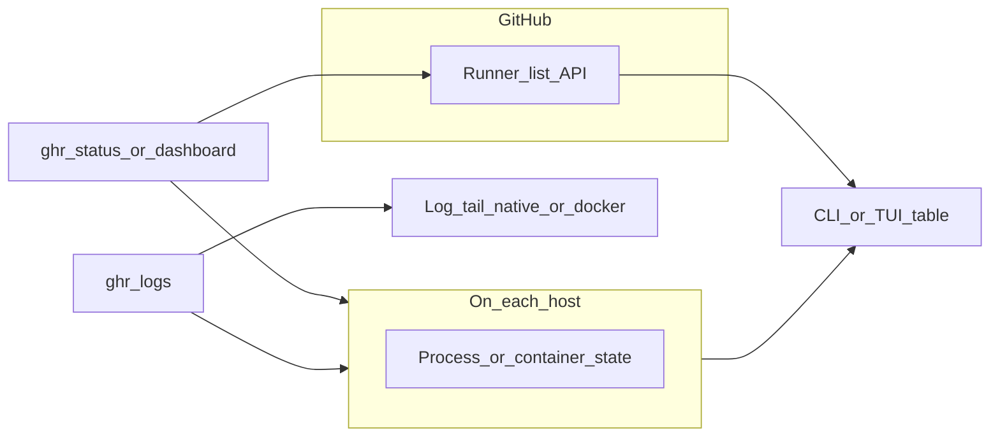

# ghr

A CLI tool to manage self-hosted GitHub Actions runners across multiple hosts — all from your laptop over SSH.

- **Unified commands** — `up`, `down`, `status`, `setup` work for Linux, macOS, and Windows runners
- **SSH & local** — manage remote hosts over SSH, or run runners on the local machine with `addr: local`
- **Declarative config** — one YAML file defines your hosts and runners
- **Multi-host** — manage runners on any number of machines (local PCs, Mac Minis, VPS)
- **Docker & native** — Linux runners use Docker containers (including on Windows via Docker Desktop); macOS and Windows run natively
- **Interactive dashboard** — TUI with live status updates

---

## Architecture

```
Your Laptop (control plane)
  └── ghr CLI
        ├── local  → This machine (native/Docker runners)
        ├── SSH → Mac Mini (native runners)
        ├── SSH → Windows PC (native + Docker runners)
        └── SSH → VPS (Docker runners)
```

The CLI reads a YAML config (see [Config file location](#config-file-location)), connects to each host over SSH (or runs commands locally for `addr: local` hosts), and executes the appropriate commands to manage runner processes. Your laptop is the only machine that needs the `ghr` binary. For a deeper walkthrough, see [How it works](#how-it-works).

---

## How it works

This section describes where runners actually run, how `ghr` reaches each host, and how `status`, `dashboard`, and `logs` collect information.

### Control plane vs execution plane

`ghr` is a **control plane** only: it runs on your machine and issues commands. The **GitHub Actions runner** (native process or Docker container) always runs on the **target host** from your config—either the same machine as `ghr` when `addr: local`, or a remote machine over SSH.



### Where runners run

**Mode** (`native` vs `docker`) is resolved per runner. If you omit `mode`, Linux hosts default to **docker**; Windows and macOS default to **native**. You can override with `runners[].mode`.

| Host OS | Default mode | Where the workload runs |
|--------|--------------|-------------------------|
| Linux | `docker` | Docker on that host: container name `gh-runner-<instance>`, image `ghcr.io/actions/actions-runner:latest`. On non-Windows hosts the container typically mounts the Docker socket for workflow `docker` steps. |
| Linux | `native` (if set) | Files under `$HOME/actions-runner/<instance>`; process via `run.sh` and a PID file. |
| Windows | `native` | `C:\actions-runner\<instance>`; process via `run.cmd` and a PID file. |
| Windows | `docker` (if set) | Same Docker image on Docker Desktop over the same SSH connection as native Windows runners. |
| macOS | `native` | `$HOME/actions-runner/<instance>`. |

**Instances:** `count` creates separate runners named `<name>-1`, `<name>-2`, … on the same host, each with its own directory (native) or container (docker).



### How commands reach a host

- **`addr: local`** — `ghr` runs commands on the machine where the CLI runs (no SSH).
- **Remote SSH** — `ghr` opens one SSH client per host for the duration of that subcommand; each remote action uses a new session on that connection.
- **Windows over SSH** — remote automation uses PowerShell (`powershell.exe` or `pwsh.exe` per `windows_ps`) with an encoded command so quoting works regardless of the user’s default SSH shell.
- **Linux / macOS over SSH** — commands run as shell commands on the remote user’s environment.



### Lifecycle commands (what they do)

| Command | Behavior |
|---------|----------|
| `ghr setup` | Install/configure runner software or Docker image pull on the host. For **docker** mode on a given host, only the **first** matching runner row runs host-level Docker setup; additional docker-mode runners on that host skip duplicate setup. |
| `ghr up` / `ghr down` | Start or stop each instance (native process or container). |
| `ghr restart` | `down` then `up`; stop errors are ignored before start. |
| `ghr update` | Remove local runner registration (native) or container (docker), then setup and start again—use when upgrading the runner stack. |
| `ghr cleanup` | Deletes **offline** runners from the GitHub API only; it does not remove local install dirs or Docker containers. |



### Status, dashboard, and logs

**`ghr status`** and **`ghr dashboard`** both:

1. Connect to each host (or mark instances **unreachable** if connection fails).
2. Ask the host whether each instance is **running** or **stopped** (native: PID file + process check; docker: `docker inspect`).
3. Call the **GitHub API** to match runner **names** and show online/offline/busy from GitHub’s view.

**`ghr logs <name>`** looks up the runner block by **base name** or a full **instance** name (`name-1`, `name-2`, …), connects to the host, then tails logs for that instance:

- **Native** — last lines of `runner.log` under that instance’s directory (`$HOME/actions-runner/<instance>` or `C:\actions-runner\<instance>`).
- **Docker** — last lines from `docker logs` for container `gh-runner-<instance>`.

If `count` is greater than 1, pass the specific instance (for example `myapp-1`) so logs match the right directory or container.



---

## Install

```bash
go install github.com/an-lee/ghr/cmd/ghr@latest
```

`go install` does not create config files. After installing, run:

```bash
ghr init
```

This creates `~/.ghr/runners.yml` from a template and `~/.ghr/env` for secrets (optional). Then edit those files (or use `ghr config edit` / `ghr config edit-env`), run `ghr config validate`, and you are ready to use `ghr status` and other commands.

Or build from source:

```bash
git clone https://github.com/an-lee/ghr.git
cd ghr
go build -o ghr ./cmd/ghr/
```

On Windows without GNU Make, use `go build` as above; Go writes `ghr.exe` when you pass `-o ghr`.

**Makefile (optional):** Requires [GNU Make](https://www.gnu.org/software/make/) and the same Go version as in `go.mod` / CI (see [Prerequisites](#prerequisites)). Works on Linux and macOS, and on Windows in a Unix-like environment (for example WSL2 or MSYS2) where `make`, `rm`, and a POSIX shell are available. The `install` target uses the `install` utility from coreutils and is intended for Unix-like systems only, not plain cmd.exe or PowerShell.

| Target | Description |
|--------|-------------|
| `make` / `make build` | Build `./cmd/ghr` into `ghr` (or `ghr.exe` on Windows when `OS` is `Windows_NT`). |
| `make test` | Run `go test ./... -race -count=1` (same as CI). |
| `make vet` | Run `go vet ./...`. |
| `make check` | Run `vet` then `test`. |
| `make clean` | Remove the built binary in the repo root. |
| `make install` | Install the binary to `$(PREFIX)/bin` (default `PREFIX=/usr/local`). Set `DESTDIR` for staged installs (packaging). |

To use the checked-in example at `config/runners.yml` while hacking on this repo, point the CLI at it explicitly, for example `export GHR_CONFIG="$PWD/config/runners.yml"` or `ghr -c config/runners.yml status`.

---

## Prerequisites

**On your laptop:**
- Go 1.22+ (for building)
- SSH key-based access to remote runner hosts (not needed for `addr: local` hosts)

**On runner hosts:**
- **Linux** — Docker installed (for `mode: docker`) or just a shell (for `mode: native`)
- **macOS** — `curl` available (pre-installed)

#### Linux SSH user and privileges

`ghr setup` and `ghr update` run remote commands as the SSH user in `hosts.*.addr`. On Linux, if that user is **not** root and the `sudo` binary is on the remote `PATH`, `ghr` prefixes some steps with `sudo` (package installs, GitHub’s `installdependencies.sh` for native runners, and the Docker install script when Docker is missing). SSH sessions are non-interactive, so **passwordless `sudo`** (or running as **`root@host`**) is the reliable choice for those steps.

- **Docker mode** — If Docker is not already installed, expect a privilege path (root or working `sudo`). If Docker is installed and your user can run `docker` without `sudo` (for example via the `docker` group), routine `ghr` operations do not need `sudo`.
- **Native mode** — You can avoid `sudo` if `curl` and `tar` are present and OS packages the runner needs are already installed; otherwise `ghr` may print warnings and the runner might be incomplete.

`ghr` does not verify sudoers rules; failures show up as remote command errors or warnings.

- **Windows** — OpenSSH Server enabled; Docker Desktop if you want Linux container runners (`mode: docker`):
  ```powershell
  Add-WindowsCapability -Online -Name OpenSSH.Server~~~~0.0.1.0
  Start-Service sshd
  Set-Service -Name sshd -StartupType Automatic
  ```
  **SSH default shell:** OpenSSH may use cmd.exe or PowerShell 7 (`pwsh`) as the remote shell depending on your setup. ghr runs Windows automation via `powershell.exe` or `pwsh.exe` with `-EncodedCommand`, so it works with either default. Use `windows_ps: pwsh` on the host if you rely on PowerShell 7 only and do not have Windows PowerShell 5.1.

---

## Config file location

When you do **not** pass `--config` / `-c`, the config file is chosen in this order:

1. **`GHR_CONFIG`** — path to a YAML file (absolute or relative to the current working directory).
2. **`~/.ghr/runners.yml`** — default after `ghr init`.

There is no automatic discovery of `./config/runners.yml` in the current directory; use `GHR_CONFIG` or `-c` if your file lives elsewhere.

If you pass `-c /path/to/runners.yml`, that path is always used (and `GHR_CONFIG` is ignored).

Run `ghr config path` to see which config file and `~/.ghr/env` path apply in your environment.

## Secrets (`~/.ghr/env`)

Before the YAML file is loaded, `ghr` applies environment variables from **`~/.ghr/env`** if that file exists (dotenv-style: `KEY=value`, optional `export `, `#` comments). This keeps secrets out of your shell history and out of the YAML file. Pair it with `github.pat: env:GITHUB_PAT` in `runners.yml`. Create the directory and file with `ghr init`, or run `ghr config edit-env`.

Keep `~/.ghr` permissions tight (`chmod 700 ~/.ghr`, `chmod 600 ~/.ghr/env` if you create files by hand).

## Configuration

### 1. Create a GitHub PAT

Go to **GitHub → Settings → Developer settings → Personal access tokens → Fine-grained tokens**.

- **Repository access**: select repos you want runners for
- **Permissions → Repository → Administration**: Read and write

### 2. Set up environment

Either put the token in `~/.ghr/env`:

```bash
# ~/.ghr/env
GITHUB_PAT=github_pat_...
```

Or export it in your shell:

```bash
export GITHUB_PAT=github_pat_...
```

### 3. Edit config

Edit `~/.ghr/runners.yml` (after `ghr init`), or set `GHR_CONFIG` / `-c` to another YAML file. You can open the resolved file in `$VISUAL` or `$EDITOR` with `ghr config edit`.

```yaml
github:
  pat: env:GITHUB_PAT

hosts:
  my-laptop:
    addr: local              # run on the local machine (no SSH)
    # os and arch are auto-detected; override if needed

  mac-mini:
    addr: user@192.168.1.50
    os: darwin
    arch: arm64

  win-pc:
    addr: user@192.168.1.51
    os: windows
    arch: amd64

  vps-1:
    addr: root@203.0.113.10
    os: linux
    arch: amd64

runners:
  - name: enjoy-local
    repo: an-lee/enjoy
    host: my-laptop
    count: 1
    labels: [self-hosted, Linux, X64]
    mode: native

  - name: enjoy-mac
    repo: an-lee/enjoy
    host: mac-mini
    count: 1
    labels: [self-hosted, macOS, ARM64]

  - name: enjoy-win
    repo: an-lee/enjoy
    host: win-pc
    count: 1
    labels: [self-hosted, Windows, X64]

  - name: enjoy-linux-on-win
    repo: an-lee/enjoy
    host: win-pc
    mode: docker   # Linux container via Docker Desktop
    count: 1
    labels: [self-hosted, Linux, X64]

  - name: hangar-ci
    repo: an-lee/hangar
    host: vps-1
    count: 2
    labels: [self-hosted, Linux, X64]
    mode: docker
```

### Config reference

| Field | Description |
|---|---|
| `github.pat` | GitHub PAT. Use `env:VAR_NAME` to read from environment. |
| `hosts.<name>.addr` | SSH target (`user@host` or `user@ip`), or `local` to run on the machine where ghr is running. Remote commands run as that user; on Linux, privilege expectations for `setup` / `update` follow the [Linux SSH user and privileges](#linux-ssh-user-and-privileges) section. |
| `hosts.<name>.os` | `linux`, `darwin`, or `windows`. Auto-detected when `addr` is `local`. |
| `hosts.<name>.arch` | `amd64` or `arm64`. Auto-detected when `addr` is `local`. |
| `hosts.<name>.windows_ps` | Optional; **Windows hosts only.** Which executable runs remote PowerShell payloads: `powershell` (default, `powershell.exe`) or `pwsh` (`pwsh.exe`). ghr uses `-EncodedCommand` so the user’s SSH default shell (cmd.exe or pwsh) does not break nested quoting. |
| `runners[].name` | Base name (instances become `name-1`, `name-2`, ...) |
| `runners[].repo` | GitHub `owner/repo` |
| `runners[].host` | References a key under `hosts` |
| `runners[].count` | Number of parallel instances (default: 1) |
| `runners[].labels` | Labels for workflow `runs-on` matching |
| `runners[].mode` | `docker` or `native` (default: `docker` for Linux hosts, `native` for others). Set `docker` on a Windows host for Linux container runners via Docker Desktop. |

---

## Commands

```bash
ghr init [--force]       # Create ~/.ghr with template runners.yml and env file
ghr setup [names...]     # Install runner binary and configure on hosts
ghr up [names...]        # Start runners
ghr down [names...]      # Stop runners
ghr restart [names...]   # Stop then start
ghr status               # Show status table
ghr logs <name>          # Show recent logs from a runner
ghr cleanup              # Remove offline/ghost runners from GitHub
ghr update [names...]    # Update runner binary (remove + setup + start)
ghr config path          # Print resolved config and ~/.ghr/env paths
ghr config show          # Print resolved configuration (PAT redacted)
ghr config edit          # Edit resolved runners.yml in $VISUAL / $EDITOR
ghr config edit-env      # Edit ~/.ghr/env in $VISUAL / $EDITOR
ghr config validate      # Validate config (exit 0 if OK)
ghr dashboard            # Launch interactive TUI dashboard
```

**Backward compatibility:** older releases treated `ghr config` as “print configuration”. That is now `ghr config show`; plain `ghr config` lists subcommands.

### Filters

All commands accept `--host` and `--repo` flags:

```bash
ghr status --host mac-mini
ghr up --repo an-lee/enjoy
ghr down enjoy-win-1
```

---

## Quick start

```bash
# 1. Set up runners on all hosts
ghr setup

# 2. Start everything
ghr up

# 3. Check status
ghr status

# 4. Launch dashboard for live monitoring
ghr dashboard
```

---

## Using runners in workflows

Reference runners by label in your workflow files:

```yaml
jobs:
  build-linux:
    runs-on: [self-hosted, Linux, X64]

  build-mac:
    runs-on: [self-hosted, macOS, ARM64]

  build-win:
    runs-on: [self-hosted, Windows, X64]
```

---

## Common tasks

### Add a new host

1. Add an entry under `hosts` in your resolved config file (`~/.ghr/runners.yml` by default)
2. Ensure SSH key-based access works: `ssh user@host true`
3. Add runner entries referencing the new host
4. Run `ghr setup && ghr up`

### Scale up

Change `count` in your runners YAML, then:

```bash
ghr setup   # configures new instances
ghr up      # starts them
```

### Update runner version

```bash
ghr update
```

This removes existing runners, downloads the latest runner binary, reconfigures, and starts them.

### Clean up ghost runners

```bash
ghr cleanup
```

---

## Local host runners

You can set up runners on the same machine where ghr runs, without SSH. Set `addr: local` on a host and ghr will execute commands directly via `os/exec` instead of dialing an SSH connection.

When `addr` is `local`, the `os` and `arch` fields are **auto-detected** from the Go runtime (`runtime.GOOS` / `runtime.GOARCH`) and can be omitted. You can still set them explicitly to override.

```yaml
hosts:
  my-laptop:
    addr: local

runners:
  - name: my-local-runner
    repo: owner/repo
    host: my-laptop
    count: 1
    labels: [self-hosted, Linux, X64]
    mode: native
```

Both `native` and `docker` modes work with local hosts. Docker mode requires Docker to be installed and accessible to the current user.

---

## Linux runners on a Windows host

You can run Linux container runners on a Windows machine without a separate SSH endpoint into WSL2. Set `mode: docker` on a runner that targets a `os: windows` host and ghr will manage the Docker container over the same SSH connection (Docker CLI invoked through the same encoded PowerShell path as native Windows runners).

**Requirements on the Windows host:**
- OpenSSH Server enabled (see [Prerequisites](#prerequisites))
- Docker Desktop installed and running with the default Linux containers mode

```yaml
hosts:
  win-pc:
    addr: user@192.168.1.51
    os: windows
    arch: amd64

runners:
  # Native Windows runner
  - name: myapp-win
    repo: owner/repo
    host: win-pc
    labels: [self-hosted, Windows, X64]

  # Linux runner via Docker Desktop on the same Windows host
  - name: myapp-linux
    repo: owner/repo
    host: win-pc
    mode: docker
    labels: [self-hosted, Linux, X64]
```

Both runners share a single SSH connection to Windows. The native runner starts `run.cmd` via PowerShell; the Docker runner calls `docker run` the same way, which talks to Docker Desktop's Linux engine.

---

## File structure

```
ghr/
  cmd/
    ghr/
      main.go               # CLI entry point
  internal/
    config/
      config.go             # YAML config parsing and validation
      envfile.go            # ~/.ghr/env dotenv loader
      paths.go              # Config path resolution, ~/.ghr helpers
      load.go               # LoadFromPath with missing-file hints
      template.go           # Embedded template for ghr init
      runners.yml.template  # Default runners.yml content
    editor/
      editor.go             # $VISUAL / $EDITOR / platform default
    host/
      host.go               # Host abstraction
      connection.go         # SSH connection management (Executor interface)
      local.go              # Local command execution (addr: local)
    runner/
      runner.go             # Runner lifecycle orchestration
      native.go             # Native runner management (mac/win/linux)
      docker.go             # Docker runner management
      github.go             # GitHub API client
    tui/
      dashboard.go          # Interactive TUI dashboard
      status.go             # Status table rendering
      styles.go             # Lipgloss styles
  config/
    runners.yml             # Example YAML (not auto-loaded; use GHR_CONFIG or -c)
  go.mod
  go.sum
```
