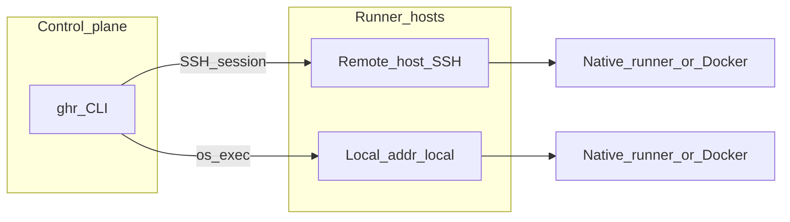
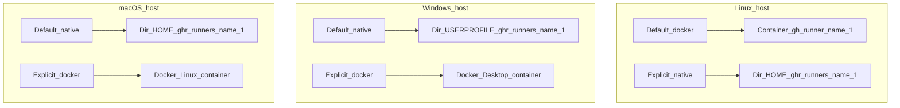
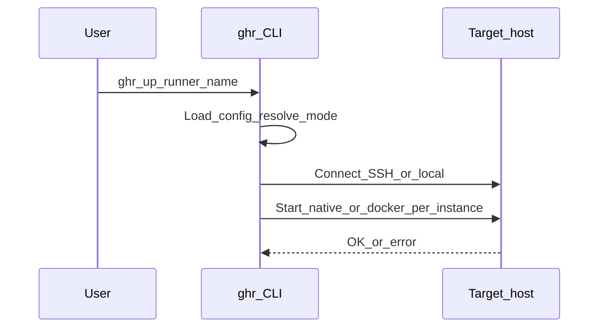
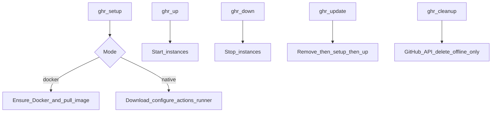
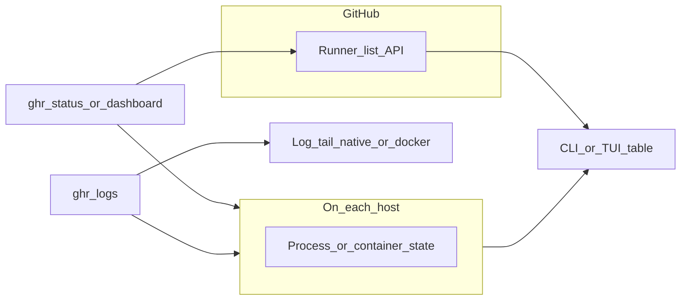

# Architecture

This page explains where runners run, how **ghr** reaches each host, and how `status`, `dashboard`, and `logs` collect information.

## Control plane vs execution plane

**ghr** is a **control plane** only: it runs on your machine and issues commands. The **GitHub Actions runner** (native process or Docker container) always runs on the **target host** from your config—either the same machine as **ghr** when `addr: local`, or a remote machine over SSH.



## Where runners run

**Mode** (`native` vs `docker`) is resolved per runner. If you omit `mode`, Linux hosts default to **docker**; Windows and macOS default to **native**. You can override with `runners[].mode`.

| Host OS | Default mode | Where the workload runs |
|--------|--------------|-------------------------|
| Linux | `docker` | Docker on that host: container name `gh-runner-<instance>`, image `ghcr.io/actions/actions-runner:latest`. ghr starts it with `config.sh --unattended` (once per container) then `run.sh`, using `ACTIONS_RUNNER_INPUT_*` env vars. On non-Windows hosts the container typically mounts the Docker socket for workflow `docker` steps. |
| Linux | `native` (if set) | Files under `~/.ghr/runners/<instance>`; process via `run.sh` and a PID file. |
| Windows | `native` | `%USERPROFILE%\.ghr\runners\<instance>`; process via `run.cmd` and a PID file. |
| Windows | `docker` (if set) | Same Docker image on Docker Desktop over the same SSH connection as native Windows runners. |
| macOS | `native` | `~/.ghr/runners/<instance>`. |
| macOS | `docker` (if set) | Same Linux runner image as on Linux; requires Docker Desktop, OrbStack, or Colima with a working `docker` CLI. |

**Instances:** `count` creates separate runners named `<name>-1`, `<name>-2`, … on the same host, each with its own directory (native) or container (docker).



## How commands reach a host

- **`addr: local`** — **ghr** runs commands on the machine where the CLI runs (no SSH).
- **Remote SSH** — **ghr** opens one SSH client per host for the duration of that subcommand; each remote action uses a new session on that connection.
- **Windows over SSH** — Remote automation uses PowerShell (`powershell.exe` or `pwsh.exe` per `windows_ps`) with an encoded command so quoting works regardless of the user’s default SSH shell.
- **Linux / macOS over SSH** — Commands run as shell commands on the remote user’s environment.



## Lifecycle commands (what they do)

| Command | Behavior |
|---------|----------|
| `ghr setup` | Install/configure runner software or Docker image pull on the host. For **docker** mode on a given host, only the **first** matching runner row runs host-level Docker setup; additional docker-mode runners on that host skip duplicate setup. |
| `ghr up` / `ghr down` | Start or stop each instance (native process or container). |
| `ghr restart` | `down` then `up`; stop errors are ignored before start. |
| `ghr update` | Remove local runner registration (native) or container (docker), then setup and start again—use when upgrading the runner stack. |
| `ghr cleanup` | Deletes **offline** runners from the GitHub API only; it does not remove local install dirs or Docker containers. |
| `ghr service install` / `uninstall` / `status` | **Native** runners only: install OS autostart (systemd on Linux, LaunchAgent on macOS, scheduled task at logon on Windows). **Docker** rows are skipped; containers already use Docker’s `--restart unless-stopped`. After install, `ghr up` and `ghr down` start/stop the same supervisor instead of a bare `nohup` / Win32 process. |
| `ghr doctor` | Read-only checks: local paths, config, GitHub API, SSH targets, Docker vs native prerequisites. Use `--strict` to treat **WARN** as failure. |



## Status, dashboard, and logs

**`ghr status`** and **`ghr dashboard`** both:

1. Connect to each host (or mark instances **unreachable** if connection fails).
2. Ask the host whether each instance is **running** or **stopped** (native: PID file + process check; docker: `docker inspect`).
3. Call the **GitHub API** to match runner **names** and the runner’s **OS** (from the API’s `os` field vs native vs docker mode) so two config rows with the same instance name on different platforms do not show each other’s GitHub state.

**`ghr logs <name>`** looks up the runner block by **base name** or a full **instance** name (`name-1`, `name-2`, …), connects to the host, then tails logs for that instance. Use **`--host`** when the same instance name exists on more than one machine.

- **Native** — Last lines of `runner.log` under that instance’s directory (`~/.ghr/runners/<instance>` on Linux/macOS, or `%USERPROFILE%\.ghr\runners\<instance>` on Windows). On Windows, if that file is missing or empty, ghr tails the newest `*.log` under `_diag` in the same directory.
- **Docker** — Last lines from `docker logs` for container `gh-runner-<instance>`.

If `count` is greater than 1, pass the specific instance (for example `myapp-1`) so logs match the right directory or container.



## Autostart and reboot

**Docker mode:** `docker run` uses **`--restart unless-stopped`**. If the container was **running** when the host shut down, it is typically started again when the Docker daemon comes up after reboot. **`ghr down`** runs `docker stop`; a **stopped** container is **not** brought back on boot until you run **`ghr up`** (or start the container another way).

**Native mode:** A normal **`ghr up`** starts the listener as a background process that **does not** survive reboot. Install autostart once per instance:

```bash
ghr service install              # all runners (native only; docker rows are skipped)
ghr service install myrunner     # one runner block
ghr service install --system     # Linux only: unit in /etc/systemd/system (needs passwordless sudo or root SSH)
ghr service status
ghr service uninstall
```

**Linux (user units, default):** Units live under `~/.config/systemd/user/`. On many **headless** servers the user manager does not run at boot until someone logs in. Enable **lingering** once (as root): `loginctl enable-linger <ssh-user>` so `systemctl --user` services start at boot.

**Linux (`--system`):** Writes `/etc/systemd/system/ghr-runner-<instance>.service` with `User=` / `Group=` set to the SSH user. Requires the same non-interactive **`sudo`** behavior as `ghr setup` on Linux.

**macOS:** LaunchAgents run in the **logged-in** user session. A Mac mini without an interactive login may need autologin or another approach for purely headless use.

**Windows:** The scheduled task uses an **at logon** trigger (`RunLevel Limited`). Servers that never log on interactively may need a different trigger or service wrapper.
