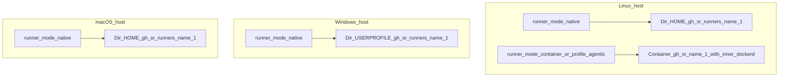
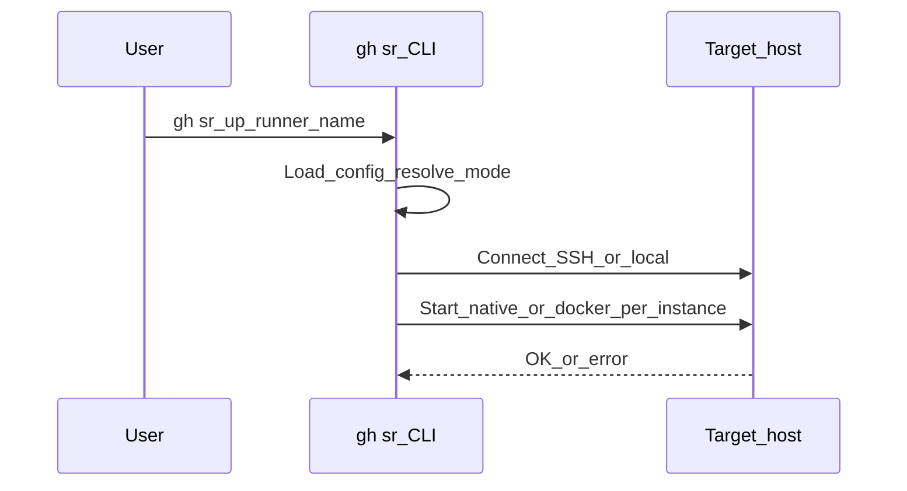
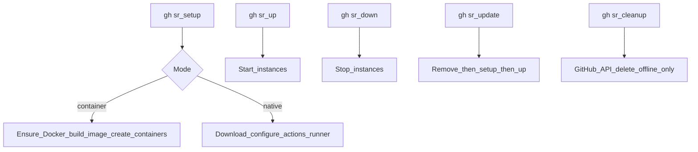
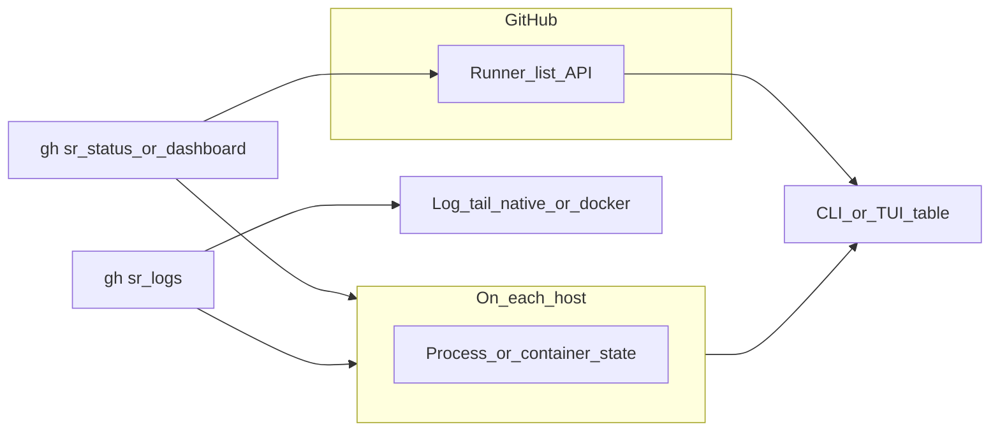

# Architecture

This page explains where runners run, how **gh sr** reaches each host, and how `status`, `dashboard`, and `logs` collect information.

## Control plane vs execution plane

**gh sr** is a **control plane** only: it runs on your machine and issues commands. The **GitHub Actions runner** (native process or Docker container) always runs on the **target host** from your config—either the same machine as **gh sr** when `addr: local`, or a remote machine over SSH.

```mermaid
flowchart LR
  subgraph controlPlane [Control_plane]
    gh sr[gh sr_CLI]
  end
  subgraph targets [Runner_hosts]
    h1[Remote_host_SSH]
    h2[Local_addr_local]
  end
  gh sr -->|SSH_session| h1
  gh sr -->|os_exec| h2
  h1 --> n1[Native_runner_or_Docker]
  h2 --> n2[Native_runner_or_Docker]
```

## Where runners run

**Runner mode** (`native` vs `container`) is resolved per runner via `runners[].runner_mode`. The default is **`native`**. Set **`runner_mode: container`** for privileged Docker-in-Docker (DinD) isolation. **`profile: agentic` always implies `container` mode** — see [Agentic Workflows](guides/agentic-workflows.md).

| Host OS | Typical setup | Where the workload runs |
|--------|---------------|-------------------------|
| Linux | `runner_mode: native` (default) | Files under `~/.gh-sr/runners/<instance>`; process via `run.sh` and a PID file (or systemd when installed). |
| Linux | `runner_mode: container` or `profile: agentic` | Privileged outer container `gh-sr-<instance>` with an inner `dockerd`; image `gh-sr/agentic-runner:<version>` built locally by `gh sr setup`. gh-aw, AWF, DNS, and tooling live inside the image. |
| Windows | `runner_mode: native` (default) | `%USERPROFILE%\.gh-sr\runners\<instance>`; process via `run.cmd` and a PID file. |
| macOS | `runner_mode: native` (default) | `~/.gh-sr/runners/<instance>`. |

**Instances:** `count` creates separate runners named `<name>-1`, `<name>-2`, … on the same host, each with its own directory (native) or container (container mode).



## How commands reach a host

- **`addr: local`** — **gh sr** runs commands on the machine where the CLI runs (no SSH).
- **Remote SSH** — **gh sr** opens one SSH client per host for the duration of that subcommand; each remote action uses a new session on that connection.
- **Windows over SSH** — Remote automation uses PowerShell (`powershell.exe` or `pwsh.exe` per `windows_ps`) with an encoded command so quoting works regardless of the user’s default SSH shell.
- **Linux / macOS over SSH** — Commands run as shell commands on the remote user’s environment.



## Lifecycle commands (what they do)

| Command | Behavior |
|---------|----------|
| `gh sr setup` | Install/configure runner software on the host. For **container** mode, builds the local `gh-sr/agentic-runner` image (if needed) and creates outer runner containers. |
| `gh sr up` / `gh sr down` | Start or stop each instance (native process or outer container). |
| `gh sr restart` | `down` then `up`; stop errors are ignored before start. |
| `gh sr update` | Remove local runner registration (native) or outer container (container mode), then setup and start again—use when upgrading the runner stack. |
| `gh sr cleanup` | Deletes **offline** runners from the GitHub API only; it does not remove local install dirs or Docker containers. |
| `gh sr service install` / `uninstall` / `status` | **Native** runners only: install OS autostart (systemd on Linux, LaunchAgent on macOS, scheduled task at logon on Windows). **Container** rows are skipped; outer containers use Docker’s `--restart on-failure` with a bootstrap retry cap. After install, `gh sr up` and `gh sr down` start/stop the same supervisor instead of a bare `nohup` / Win32 process. All three service commands dispatch **one SSH connection per host concurrently**, so they complete in roughly the time it takes to reach the slowest single host; output order across hosts is non-deterministic. |
| `gh sr doctor` | Read-only checks: local paths, config, GitHub API, SSH targets, native vs container prerequisites (scoped to filtered runners). Use `--strict` to treat **WARN** as failure; use `--fix` to re-run `setup` and doctor after failures. Host SSH checks run **concurrently** (one goroutine per host), and GitHub API checks (repos and orgs) are also issued concurrently; results in both sections are printed in sorted order. |



## Status, dashboard, and logs

**`gh sr status`** and **`gh sr dashboard`** both:

1. Connect to each host **concurrently** (or mark instances **unreachable** if connection fails) — all SSH connections are opened in parallel so the command completes in roughly the time it takes to reach the slowest host.
2. Ask the host whether each instance is **running** or **stopped** (native: PID file + process check; container: `docker inspect` on `gh-sr-<instance>`).
3. Call the **GitHub API** for each repo **concurrently** to match runner **names** and the runner’s **OS** (from the API’s `os` field vs native vs container mode) so two config rows with the same instance name on different platforms do not show each other’s GitHub state.

**`gh sr logs <name>`** looks up the runner block by **base name** or a full **instance** name (`name-1`, `name-2`, …), connects to the host, then tails logs for that instance. Use **`--host`** when the same instance name exists on more than one machine.

- **Native** — Last lines of `runner.log` under that instance’s directory (`~/.gh-sr/runners/<instance>` on Linux/macOS, or `%USERPROFILE%\.gh-sr\runners\<instance>` on Windows). On Windows, if that file is missing or empty, gh sr tails the newest `*.log` under `_diag` in the same directory.
- **Container** — Last lines from `docker logs` for outer container `gh-sr-<instance>`.

If `count` is greater than 1, pass the specific instance (for example `myapp-1`) so logs match the right directory or container.



## Autostart and reboot

**Container mode:** outer containers use **`--restart on-failure`** with a persisted bootstrap failure cap. If the container was **running** when the host shut down, it is typically started again when the Docker daemon comes up after reboot. **`gh sr down`** runs `docker stop`; a **stopped** container is **not** brought back on boot until you run **`gh sr up`** (or start the container another way). After repeated inner-`dockerd` bootstrap failures, the container holds in a **`failed`** state visible in **`gh sr status`** until you fix the host and run **`gh sr up`** again.

**Native mode:** A normal **`gh sr up`** starts the listener as a background process that **does not** survive reboot. Install autostart once per instance:

```bash
gh sr service install              # all runners (native only; container rows are skipped)
gh sr service install myrunner     # one runner block
gh sr service install --system     # Linux only: unit in /etc/systemd/system (needs passwordless sudo or root SSH)
gh sr service status
gh sr service uninstall
```

**Linux (user units, default):** Units live under `~/.config/systemd/user/`. On many **headless** servers the user manager does not run at boot until someone logs in. Enable **lingering** once (as root): `loginctl enable-linger <ssh-user>` so `systemctl --user` services start at boot.

**Linux (`--system`):** Writes `/etc/systemd/system/ghsr-runner-<instance>.service` with `User=` / `Group=` set to the SSH user. Requires the same non-interactive **`sudo`** behavior as `gh sr setup` on Linux.

**macOS:** LaunchAgents run in the **logged-in** user session. A Mac mini without an interactive login may need autologin or another approach for purely headless use.

**Windows:** The scheduled task uses an **at logon** trigger (`RunLevel Limited`). Servers that never log on interactively may need a different trigger or service wrapper.
