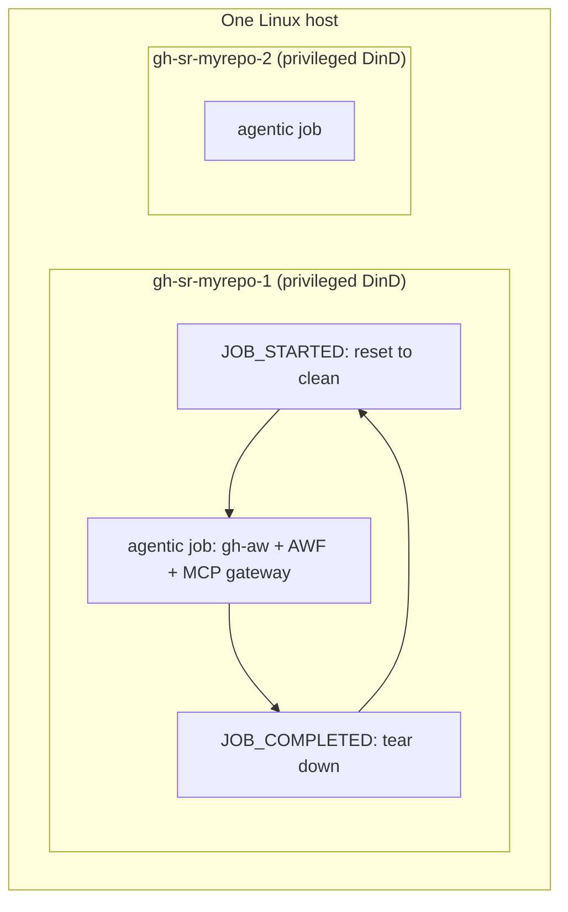

# Running GitHub Agentic Workflows (gh-aw) on self-hosted runners

[GitHub Agentic Workflows](https://github.github.com/gh-aw/) (`gh-aw`) are markdown workflow files compiled to GitHub Actions via `gh aw compile`. They run a live AI agent (Claude, Copilot, Codex, …) inside a sandboxed Docker stack that decides what tools to call and what steps to take.

## 1. Why agentic runners use container mode

gh-aw was designed for **GitHub-hosted runners**, where every job gets a fresh, single-tenant VM. Each compiled workflow hardcodes machine-global resources:

- the runtime tree **`/tmp/gh-aw`** (~80 references per workflow, including a `-v /tmp/gh-aw:/tmp/gh-aw:rw` mount and a `rm -rf /tmp/gh-aw` during setup),
- **fixed host-network ports** for the MCP gateway and helper servers,
- **fixed Docker/AWF names** (`gh-aw-mcpg`, `awf-net`, `awf-squid`, …) and the `DOCKER-USER` iptables chain,
- shared `$HOME` engine state (`~/.copilot`, `~/.claude`) and the Docker socket.

If several agentic jobs share one host, these collide. To make concurrent agentic runners stable on a single machine, **`gh sr` runs every `profile: agentic` runner in container mode**: each runner instance is a privileged Docker-in-Docker (DinD) container with its **own** inner `dockerd`, network namespace, MCP gateway port, `iptables`, and `/tmp/gh-aw`.

> **`profile: agentic` always implies `runner_mode: container`.** `gh sr` rejects `profile: agentic` with `runner_mode: native`, because native mode cannot isolate the resources above. (The old per-instance `agentic_mcp_ports` / `gh-sr-mcp-<port>` label scheme and the host-level dnsmasq/sudoers/`/opt/hostedtoolcache` setup are gone — they are unnecessary in container mode.)

### Pristine per job

Each long-lived runner container makes the inner environment **pristine before and after every job** via the official Actions runner hooks (`ACTIONS_RUNNER_HOOK_JOB_STARTED` / `ACTIONS_RUNNER_HOOK_JOB_COMPLETED`):

- **before a job** — remove any leftover inner containers, prune networks, flush AWF `iptables`, delete `/tmp/gh-aw`, and (re)assert the AWF service-routing bypass; verify the inner `dockerd` is healthy;
- **after a job** — tear down the gh-aw / AWF containers it created, prune networks, flush AWF rules, and delete `/tmp/gh-aw`.

The inner Docker **image-layer cache** (`/runner-state/docker-data`) is the only state preserved across jobs, so resets never re-pull gh-aw's images. This eliminates the entire class of "leftover from a previous/crashed job" failures (stale MCP gateway on the gateway port, orphan AWF containers, stale iptables) without any timing-based cleanup.



## 2. Host requirements

The host runs only the **outer** runner containers, so its requirements are minimal. Everything gh-aw needs (gh-aw CLI, AWF, Node/Python tooling, Docker CE, dnsmasq, browser packages, DNS config, sudoers) lives **inside the image** that `gh sr` builds.

| Requirement      | Details                                                                                          |
| ---------------- | ------------------------------------------------------------------------------------------------ |
| **OS**           | Linux only (Ubuntu/Debian recommended). macOS/Windows hosts are not supported for agentic.       |
| **Architecture** | `amd64` or `arm64`                                                                               |
| **Docker**       | Docker Engine installed and running on the host, with the runner user able to run `docker`.      |
| **`--privileged`** | The host must allow privileged containers (required for the inner `dockerd`).                  |

Install Docker on the host:

```bash
sudo apt-get update && sudo apt-get install -y docker.io
sudo systemctl enable --now docker
sudo usermod -aG docker "$USER"   # log out/in (or: newgrp docker)
docker run --rm --privileged alpine echo privileged-ok   # must print privileged-ok
```

That is all the host setup `gh sr` cannot do for you. There is **no** host dnsmasq, `/etc/hosts`, sudoers-for-iptables, `RUNNER_TEMP`, or `/opt/hostedtoolcache` configuration to perform — those concerns are handled inside the image.

## 3. Configuration

```yaml
hosts:
  my-linux-host:
    addr: user@192.168.1.10   # or "local"

runners:
  - name: my-agentic
    repo: owner/repo
    host: my-linux-host
    count: 3                  # 3 concurrent agentic jobs, each fully isolated
    profile: agentic          # implies runner_mode: container (DinD)
```

- `count: N` gives N isolated runner containers (`gh-sr-my-agentic-1` … `-N`) — that is your same-host concurrency. No port or label juggling is required.
- Optional extra image packages: set a global `container_runner_image.extra_apt_packages` list (Debian package names) in `runners.yml`; the image tag gains a suffix so Docker rebuilds.
- Reduced-MTU networks (cloud overlay / VPN / nested virt) are handled automatically — `gh sr` detects the host egress MTU and pins the container's inner/outer Docker MTU to it. Override with `container_runner_image.mtu` only when the host NIC hides a smaller path MTU (see §4).

Workflow frontmatter only needs standard self-hosted targeting:

```yaml
---
on: issues
runs-on: [self-hosted, linux, x64, agentic]
safe-outputs:
  create-issue: {}
---
```

## 4. What the runner image provides

`gh sr setup` builds `gh-sr/agentic-runner:<runner-version>` locally (Ubuntu 24.04). It bundles:

- **Docker CE** (the inner `dockerd` for DinD) with a **baked daemon config** that pins the inner default bridge gateway to `10.200.0.1` and points container DNS at a bundled **dnsmasq**, so `host.docker.internal` resolves deterministically for inner containers. The inner `dockerd` starts exactly once — there is no runtime DNS rewrite or daemon restart. (`10.200.0.1` is deliberately outside the host's default Docker bridge subnet `172.17.0.0/16` so the inner bridge cannot collide with the outer runner container's own network.)

  > **Why not the default `172.17.0.0/16`?** The outer runner container itself normally sits on the host's **default Docker bridge** `172.17.0.0/16` (gateway `172.17.0.1`). If the inner bridge were pinned to a `172.17.x` address it would duplicate the container's own default-gateway IP and capture that route, **black-holing all outbound traffic into the inner bridge** — the host network stays fine, but every connection made *inside* the runner (agent → model provider, `git`, package installs) crawls or times out. `10.200.0.0/24` avoids this because it lies outside Docker's default address pools (`172.16.0.0/12` and `192.168.0.0/16`).
  >
  > As **defence in depth**, `entrypoint.sh` validates the baked gateway against the runner container's *actual* interfaces just before the single `dockerd` start. If a custom host happens to attach the runner container to a subnet that overlaps `10.200.0.0/24`, the entrypoint automatically falls back to the next free candidate (`10.201.0.1`, `10.210.0.1`, …) and rewrites `daemon.json` + the dnsmasq config **once, before** `dockerd` starts (still a single start, no restart). A `WARNING: baked inner-bridge gateway … overlaps an existing interface` line in `docker logs <runner-container>` indicates the fallback was used.
  >
  > **Agent-sandbox DNS (why the runner's own `/etc/resolv.conf` is repointed).** After dnsmasq is up, `entrypoint.sh` rewrites the runner container's `/etc/resolv.conf` to a single `nameserver` = the inner-bridge gateway. This matters beyond the runner itself: AWF **auto-detects the agent sandbox's DNS servers by parsing this `/etc/resolv.conf`**. Pinning it to dnsmasq — which answers `host.docker.internal` authoritatively with the gateway IP that AWF's sandbox firewall *exempts* from its transparent Squid redirect — makes the agent reach the MCP gateway directly and deterministically. Without the pin the sandbox inherits the **outer host** resolver and intermittently maps `host.docker.internal` to a non-exempt IP, so the MCP gateway POST is force-proxied into Squid (which rejects the origin-form request with `ERR_INVALID_URL` → HTTP 400) and the agent reports `MCP server(s) failed to launch`. dnsmasq still forwards every other name to the runner container's **original** upstream resolvers (so enterprise/VPC DNS keeps working); `no-resolv` prevents dnsmasq from looping back through the repointed `resolv.conf`.
- **Reduced-MTU pinning** for hosts whose egress path MTU is below Docker's 1500 default (cloud overlay networks — GCP defaults to **1460** — VPN/WireGuard, nested virtualisation). At `docker create` time `gh sr` detects the host's primary egress-interface MTU and injects it as `GH_SR_HOST_MTU`; `entrypoint.sh` then pins both the **inner `dockerd` bridge** (`daemon.json` `mtu`) and the **outer container's `eth0`** to it (plus a `mangle` MSS clamp for forwarded inner traffic), strictly before the single `dockerd` start. This makes TCP advertise a matching MSS in both directions so large packets fit.

  > **Why this is needed.** The outer runner container sits on the host's default Docker bridge (MTU 1500) and the inner bridge also defaults to 1500. When the real host path MTU is smaller and PMTUD is black-holed (ICMP "fragmentation needed" filtered — very common), small packets pass (DNS, TCP `SYN`/`ACK`) so connections *open*, but large packets are silently dropped. TLS handshakes (the `ServerHello` + certificate chain span several full-size segments) then stall and the socket is torn down mid-handshake, surfacing as `Client network socket disconnected before secure TLS connection was established` — exactly how `actions/setup-go` fails on such hosts while the host itself downloads fine (its real NIC never emits oversized frames). Auto-detection covers the common case where the host **NIC** MTU is already below 1500; if the host NIC reports 1500 but a deeper tunnel lowers the real path MTU, force it with `container_runner_image.mtu` in `runners.yml` and `gh sr rebuild`.
- The **actions runner**, **gh-aw CLI**, and **AWF** (`github/gh-aw-firewall`), plus `gh`, **Node.js LTS** (NodeSource), Python (`uv`), Chromium/`chromium-chromedriver`, and common build/system libraries.
- The **per-job reset hooks** at `/opt/gh-sr/hooks/job-started.sh` and `/opt/gh-sr/hooks/job-completed.sh`.
- A minimal **Docker CLI shim** at `/opt/gh-sr/docker-shim/docker`. When gh-aw launches the MCP gateway (`docker run … ghcr.io/github/gh-aw-mcpg:*`) it injects two deterministic flags, then `exec`s the real `docker`: `--hostname gh-aw-mcpg` (so the gateway's self-inspect does not fail under `--network host` in DinD) and, for `docker run`, a `--name gh-aw-mcpg-ghsr-*` (so a leftover gateway is always reapable by the per-job reset hooks and `gh sr doctor`). It does not supervise the gateway or rewrite MCP config URLs — baked DNS and the job hooks make those unnecessary.

## 5. Operations

```bash
gh sr setup                 # build the image (first run) and create runner containers
gh sr up                    # start runners; waits for each to be ready (inner dockerd up, registered)
gh sr status                # show local + GitHub status, image, and BUILD freshness
gh sr logs my-agentic       # recent logs for an instance
gh sr down                  # stop the runner containers
gh sr rebuild my-agentic    # rebuild the image after a gh-sr upgrade and restart containers
gh sr remove my-agentic     # deregister from GitHub and remove container + state
```

Each instance runs as a Docker container named `gh-sr-<instance>` with `--restart unless-stopped`, so it auto-starts on host boot and auto-restarts between jobs. `gh sr up` health-gates startup: it reports a runner as ready only once the container is running, the inner `dockerd` responds, and the actions runner is registered (a slow first boot is a warning, not a failure).

The **BUILD** column in `gh sr status` compares the image's baked layout revision with the one your current `gh sr` expects: `ok` means current, `stale` means run `gh sr rebuild`, `?` means the image predates revision labels.

## 6. Health checks (`gh sr doctor`)

For each Linux host with container-mode runners, `gh sr doctor` checks:

- host Docker CLI/daemon and that a short `--privileged` test container runs (required for DinD);
- for each instance: the `gh-sr-<instance>` container exists and is **running**, the **inner `dockerd`** responds, and `.runner` is present (registered);
- for agentic instances: **Node.js LTS** and `npm` are on PATH inside the container (required by gh-aw activation setup — flagged as `container-node-npm` on stale images), `awf` is available via `sudo` inside the container, `host.docker.internal` resolves to a non-loopback address from inner containers, the runner's `/etc/resolv.conf` is pinned to the bundled dnsmasq (so the agent sandbox inherits an AWF-exempt resolver — flagged as `container-inner-resolv` otherwise), the AWF service-routing bypass is installed, no Docker interface MTU exceeds the host egress MTU (flagged as `container-mtu` on a stale, pre-MTU-pinning image when the host path MTU is below 1500), and there are no orphan `gh-aw`/`awf-`/`gh-aw-mcpg-*` containers or stale `DOCKER-USER` rules in the inner Docker.

```bash
gh sr doctor --host my-linux-host
```

## 7. State layout

Each runner container bind-mounts `$HOME/.gh-sr/runners/<instance>` at `/runner-state`:

| Path                         | Contents                                                                |
| ---------------------------- | ----------------------------------------------------------------------- |
| `/runner-state/docker-data/` | Inner Docker image-layer cache — **persistent** across jobs/restarts.   |
| `/runner-state/_work/`       | Runner job workspace.                                                    |
| `/runner-state/_temp/`       | `RUNNER_TEMP` (kept off `/tmp` so it never collides with `/tmp/gh-aw`).  |
| `/runner-state/dockerd.log`  | Inner `dockerd` log.                                                     |

The gh-aw runtime tree `/tmp/gh-aw` lives inside the container rootfs and is wiped before/after every job by the reset hooks — it is per-job scratch, never the cache.

### Disk cleanup

When `docker-data` or `_work` grow large (common on busy agentic fleets), use:

```bash
gh sr disk usage
gh sr disk prune --yes              # idle runners only; keeps inner Docker cache (default)
gh sr disk prune --yes --prune-cache # also reclaim docker-data when disk is critical
```

See [Commands — Disk usage and cleanup](../commands.md#disk-usage-and-cleanup) for scheduling and orphan cleanup.

## 8. Troubleshooting

| Symptom | Likely cause | Fix |
| ------- | ------------ | --- |
| `gh sr setup` errors: `runner_mode: container is only supported on Linux` | agentic/container runner on a non-Linux host | Use a Linux host. |
| Validation error: `profile: agentic is no longer supported with runner_mode: native` | old config pinned native mode | Remove `runner_mode: native` (agentic uses container automatically) or set `runner_mode: container`. |
| Validation error: `agentic_mcp_ports / agentic_mcp_port_base have been removed` | old per-instance MCP port config | Delete those fields; container mode isolates the port per runner. |
| `docker --privileged` fails on the host | privileged containers blocked (userns-remap, security policy) | Allow privileged containers, or use a Sysbox runtime (see below). |
| Inner `dockerd` not responding / runner not registered | slow first boot or a broken container | `gh sr logs <name>`, then `gh sr doctor`; `gh sr rebuild <name>` if persistent. |
| AWF agent → workflow `services:` (postgres/redis) `Connection refused` | AWF service-routing bypass missing in the container | `gh sr rebuild <name>` (the hooks/entrypoint install it), or apply live: `docker exec gh-sr-<instance> iptables -t nat -I PREROUTING -s 172.30.0.0/24 -m addrtype --dst-type LOCAL -j RETURN`. |
| `mcp_servers` failed inside AWF | inner DNS or a stale environment | Confirm `host.docker.internal` resolves inside the container (`docker exec gh-sr-<instance> docker run --rm alpine getent hosts host.docker.internal`); recompile workflows with a current `gh aw`. |
| `MCP server(s) failed to launch` **intermittently** (succeeds on a later run); agent log shows a Squid `ERR_INVALID_URL` page for `host.docker.internal` | runner `/etc/resolv.conf` not pinned to dnsmasq (stale pre-fix image), so the agent sandbox resolved `host.docker.internal` via the outer host to a non-exempt IP and got force-proxied into Squid | `gh sr rebuild <name>`, then verify `docker exec gh-sr-<instance> cat /etc/resolv.conf` shows a single `nameserver` equal to the inner `docker0` gateway (e.g. `10.200.0.1`). `gh sr doctor` reports this as `container-inner-resolv`. |
| `actions/setup-go` / `setup-node` (or any download) fails with `Client network socket disconnected before secure TLS connection was established`, retries, then errors — but the **host** downloads the same URL fine | container MTU (1500) exceeds the host's real egress path MTU (cloud overlay/VPN/nested virt) with PMTUD black-holed, so large TLS handshake packets are dropped | `gh sr rebuild <name>` to pick up MTU pinning (auto-detects the host egress MTU). If the host NIC reports 1500 but a tunnel lowers the real path MTU, set `container_runner_image.mtu: <value>` in `runners.yml` and rebuild. `gh sr doctor` reports a mismatch as `container-mtu`; verify with `docker exec gh-sr-<instance> cat /sys/class/net/eth0/mtu`. |
| Agentic workflow fails at `activation` with `npm is not available. Cannot install @actions/artifact package.` | gh-aw v0.79+ enables `safe-output-artifact-client` during activation setup, which runs before `actions/setup-node` | `gh sr rebuild <name>` so the image includes Node.js LTS/npm. `gh sr doctor` reports this as `container-node-npm`. Verify with `docker exec gh-sr-<instance> sh -lc 'node --version && npm --version'`. |

Inspect a running runner:

```bash
docker exec -it gh-sr-<instance> bash
docker info                       # inner dockerd
docker ps                         # agent/AWF containers for the current job
tail -f /runner-state/dockerd.log
```

### Security: `--privileged` and Sysbox

Container-mode runners use `--privileged` because the inner `dockerd` needs full Linux capabilities. This suits trusted infrastructure. For privilege-free DinD, install [Sysbox](https://github.com/nestybox/sysbox) and run the runner container with `--runtime sysbox-runc` instead of `--privileged` (not auto-configured by `gh sr`).

## 9. Migrating from native agentic / port labels

If you previously ran `profile: agentic` in native mode (with `agentic_mcp_ports` / `agentic_mcp_port_base` and `gh-sr-mcp-<port>` labels and `sandbox.mcp.port` in workflow frontmatter):

1. In `runners.yml`, delete `runner_mode: native`, `agentic_mcp_ports`, and `agentic_mcp_port_base` from agentic runners. Keep `profile: agentic` and set `count` to the concurrency you want.
2. Remove the `gh-sr-mcp-<port>` entries from your workflows' `runs-on` and any custom `sandbox.mcp.port`; recompile with `gh aw compile`.
3. Run `gh sr setup` (builds the image), then `gh sr up`.
4. Optional: drop the host-level dnsmasq/sudoers/`/opt/hostedtoolcache` tweaks the old native path created — they are no longer used.
