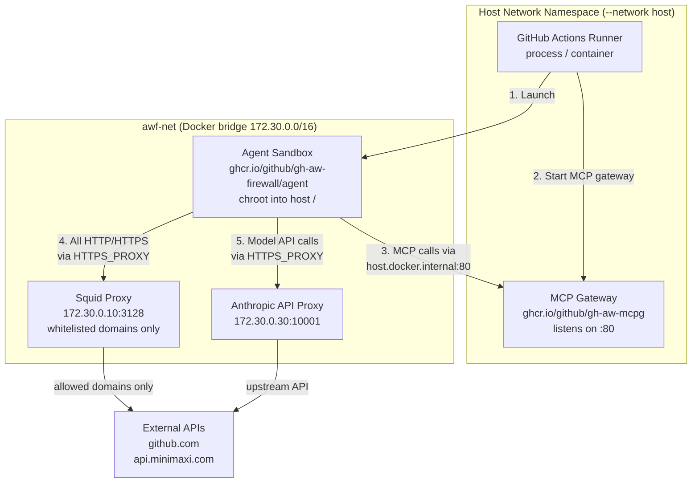
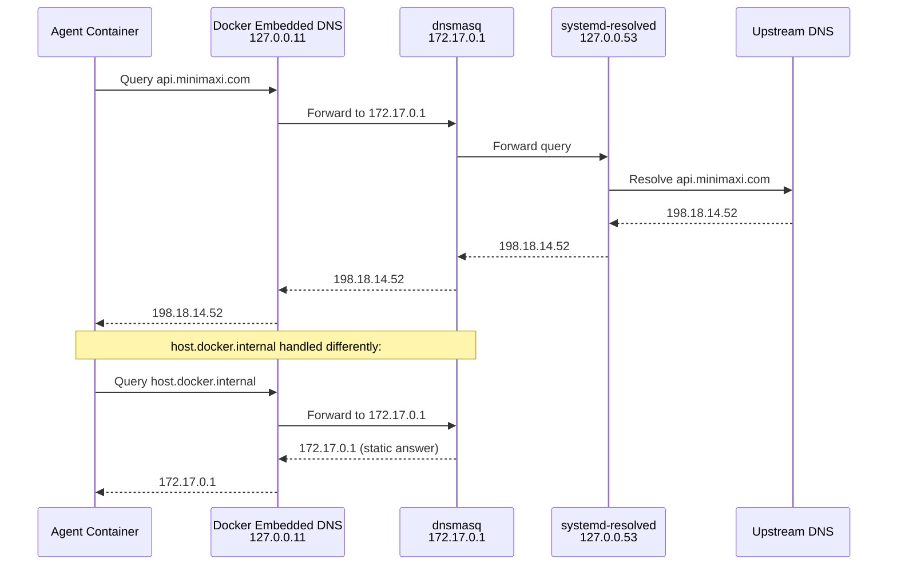

# Agentic Workflows

[GitHub Agentic Workflows](https://github.github.com/gh-aw/guides/self-hosted-runners/) (gh-aw) run AI agents inside sandboxed Docker containers on self-hosted runners. Unlike normal Actions jobs that execute a fixed script, agentic workflows run a live AI model that decides what steps to take, what tools to call, and how to respond to errors.

## How it differs from normal Actions workflows

| | Normal workflow | Agentic workflow |
|--|--|--|
| Execution model | Fixed step sequence defined in YAML | AI agent decides steps dynamically |
| Environment | Runs directly on the runner | Runs inside an isolated Docker container (sandbox) |
| Tool access | Via action steps | Via MCP (Model Context Protocol) servers |
| Network | Runner's network namespace | Separate `awf-net` bridge; egress via Squid proxy |
| State | Persistent runner filesystem | chroot into host filesystem |

## Architecture



### Components

**Runner** -- The GitHub Actions runner process. It registers with GitHub, receives job assignments, and orchestrates the workflow. For agentic workflows it is responsible for starting the MCP Gateway and Agent Sandbox containers.

**MCP Gateway** (`ghcr.io/github/gh-aw-mcpg`) -- A Docker container running on the host network (`--network host`). It hosts MCP servers that provide tools to the agent: the `github` MCP server (for GitHub API access) and the `safeoutputs` MCP server (for secure output handling). The agent container connects to it at `http://host.docker.internal:80`.

**Agent Sandbox** (`ghcr.io/github/gh-aw-firewall/agent`) -- The container that actually runs the AI agent (Claude, Codex, etc.). It runs on the `awf-net` bridge network, isolated from the host network. It uses `chroot` to access the host's filesystem as its working directory, but its network is separate. All outbound HTTP/HTTPS traffic is routed through the Squid proxy.

**Squid Proxy** -- An HTTP proxy running inside the `awf-net`. It enforces network egress control: only whitelisted domains (e.g. `github.com`, model provider APIs) are allowed through. This prevents the agent from making uncontrolled network requests.

**API Proxy** -- An internal proxy that injects authentication credentials for the model provider. The agent sends model API calls to this proxy rather than directly to the provider.

## Network architecture

The key architectural challenge: the Agent Sandbox and MCP Gateway are in **different network namespaces**.

The MCP Gateway runs on the **host network** (`--network host`), meaning it binds directly to the host's network interfaces. The Agent Sandbox runs on the **awf-net bridge network**, with its own IP (e.g. `172.30.0.x`).

To reach the MCP Gateway from the agent container, gh-aw uses the special Docker DNS name `host.docker.internal`. This name is meant to resolve to the host's IP from inside any Docker container. On macOS and Windows Docker Desktop, this is automatic. On Linux, it requires explicit configuration.

### Why `/etc/hosts` with `127.0.0.1` fails

A common first instinct is to add `127.0.0.1 host.docker.internal` to `/etc/hosts`. This **breaks** the connection because:

1. The MCP Gateway binds to `0.0.0.0:80` on the host (not `127.0.0.1`)
2. The agent container has its own `127.0.0.1` (its loopback interface)
3. When the agent resolves `host.docker.internal` to `127.0.0.1`, it tries to connect to **its own** port 80, not the host's

The correct approach: resolve `host.docker.internal` to the **docker0 bridge IP** (`172.17.0.1`), which is the host's address on the container network. Any container can reach `172.17.0.1`.

## DNS resolution on Linux

On Linux, Docker does not resolve `host.docker.internal` automatically. gh-sr configures `dnsmasq` to handle this.



### The two-layer failure we debugged

We encountered **two separate DNS failures**, each breaking a different layer of the system:

**Layer 1: MCP Gateway unreachable**

Without dnsmasq configured, `host.docker.internal` returns `NXDOMAIN` from Docker's embedded DNS. The agent cannot resolve the MCP Gateway address, and the workflow fails with:

```
Error: ERR_API: MCP server(s) failed to launch: github, safeoutputs
```

**Layer 2: Model API unreachable (503)**

Even after fixing Layer 1, the workflow still failed. dnsmasq was configured with a static record for `host.docker.internal` but **no upstream servers**:

```
# Broken config - no server= directives
address=/host.docker.internal/172.17.0.1
listen-address=172.17.0.1
bind-interfaces
```

Without `server=` directives, dnsmasq only answers queries for `host.docker.internal` (its static record) and **REFUSES** every other query. When the agent tried to resolve `api.minimaxi.com`, Docker's embedded DNS received `REFUSED`, treated it as a definitive answer, and did **not** fall back to the secondary DNS server (`8.8.8.8`) in `daemon.json`. The result: the Squid proxy could not reach the model API, returning 503.

The fix: add upstream server directives to dnsmasq:

```
address=/host.docker.internal/172.17.0.1
listen-address=172.17.0.1
bind-interfaces
server=127.0.0.53
server=8.8.8.8
```

`server=127.0.0.53` forwards to `systemd-resolved` (which respects `/etc/resolv.conf` search domains and upstream resolvers). `server=8.8.8.8` is a public fallback.

## What `profile: agentic` automates

gh-sr handles the following during `gh sr setup` for runners with `profile: agentic` on Linux:

| Step | What gh-sr does | Why |
|------|----------------|-----|
| **Docker DNS** | Installs dnsmasq, writes `/etc/dnsmasq.d/gh-sr-docker.conf`, merges DNS into `/etc/docker/daemon.json`, restarts services | Agent containers must resolve `host.docker.internal` to reach the MCP Gateway, and external DNS must work for model API calls |
| **dnsmasq config** | Listens on docker0 bridge IP, resolves `host.docker.internal` statically, forwards all other queries upstream | This is the DNS backbone for the entire agentic workflow |
| **`/opt/hostedtoolcache`** | Binds npm global prefix to `/opt/hostedtoolcache`, persists in `/etc/fstab` | gh-aw agent containers search for `claude`, `codex` etc. in `/opt/hostedtoolcache/*/bin`, which exists on GitHub Hosted Runners but not on self-hosted runners |
| **`gh-aw` CLI** | Installs from upstream script (`curl \| bash`) | Provides CLI tooling for managing AWF containers on the host |
| **`agentic` label** | Appends `agentic` to runner labels | Tells GitHub to route agentic workflow jobs to this runner |

## Common issues

| Symptom | Cause | Fix |
|---------|-------|-----|
| `ERR_API: MCP server(s) failed to launch` | `host.docker.internal` not resolving inside agent container | Run `gh sr doctor` to diagnose; `gh sr setup` configures dnsmasq automatically |
| `host.docker.internal` resolves to `127.0.0.1` | `/etc/hosts` entry maps it to localhost | Remove the entry from `/etc/hosts`; use dnsmasq to resolve it to the docker0 bridge IP |
| `Connection refused` on `host.docker.internal:80` | MCP Gateway not on host network, or bound to localhost | `profile: agentic` sets `--network host`; verify MCP Gateway container has host networking |
| 503 from model API | dnsmasq has no upstream servers, external DNS returns `REFUSED` | Add `server=127.0.0.53` and `server=8.8.8.8` to dnsmasq config; `gh sr setup` does this automatically |
| `gh: not logged in` inside agent | `gh` token stored in GNOME Keyring on host, not accessible inside container chroot | Pass `GH_TOKEN: ${{ secrets.GITHUB_TOKEN }}` as a workflow env var, or authenticate `gh` on the host with `gh auth login` |
| Tools not found (e.g. `claude: command not found`) | npm global tools not in `/opt/hostedtoolcache` | `gh sr setup` creates the bind mount automatically; verify with `mount \| grep hostedtoolcache` |
| Workflow times out waiting for agent | MCP server checks failing silently | Check the MCP Gateway container logs: `docker logs gh-aw-mcpg-*` |

## Verifying your setup

### Automatic diagnostics

```bash
gh sr doctor --host your-runner
```

For agentic runners, `gh sr doctor` checks:

- Docker CLI and daemon are available
- `docker compose` plugin is available
- `iptables` is available and `DOCKER-USER` chain exists
- Passwordless sudo is available for iptables rules
- `host.docker.internal` resolves to a non-loopback IP inside containers
- External DNS (github.com) resolves inside containers

### Manual verification

**Check `host.docker.internal` resolution:**

```bash
docker run --rm alpine sh -c "getent hosts host.docker.internal"
```

Expected: an IP that is **not** `127.0.0.1` or `::1`, typically `172.17.0.1`.

**Check external DNS resolution:**

```bash
docker run --rm alpine sh -c "nslookup github.com"
```

Expected: a resolved IP address, not `REFUSED` or `NXDOMAIN`.

**Check MCP Gateway is reachable from a container:**

```bash
docker run --rm alpine sh -c "apk add --no-cache curl > /dev/null && curl -s http://host.docker.internal:80/health"
```

Expected: `{"status":"healthy","servers":{"github":{"status":"running"},...}}`

**Check the MCP Gateway container is running with host networking:**

```bash
docker ps --format "{{.Names}} {{.Networks}} {{.Ports}}" | grep mcpg
```

Expected: no network listed (empty means host network) or `host` network, port `:80`.

## Files created on the host

When you run `gh sr setup` for an agentic runner, gh-sr may create or modify these files on the host:

| File | Purpose |
|------|---------|
| `/etc/dnsmasq.d/gh-sr-docker.conf` | dnsmasq configuration for `host.docker.internal` resolution and upstream DNS forwarding |
| `/etc/docker/daemon.json` | Docker daemon DNS settings (merged with existing config) |
| `/opt/hostedtoolcache` | Bind mount to your npm global prefix |
| `/etc/fstab` | Persistent entry for the `/opt/hostedtoolcache` bind mount |
| `~/.local/share/gh/extensions/gh-aw/` | The `gh-aw` CLI installation directory |

To see exactly what dnsmasq is configured with:

```bash
cat /etc/dnsmasq.d/gh-sr-docker.conf
```

To see what Docker's DNS settings are:

```bash
cat /etc/docker/daemon.json
```
