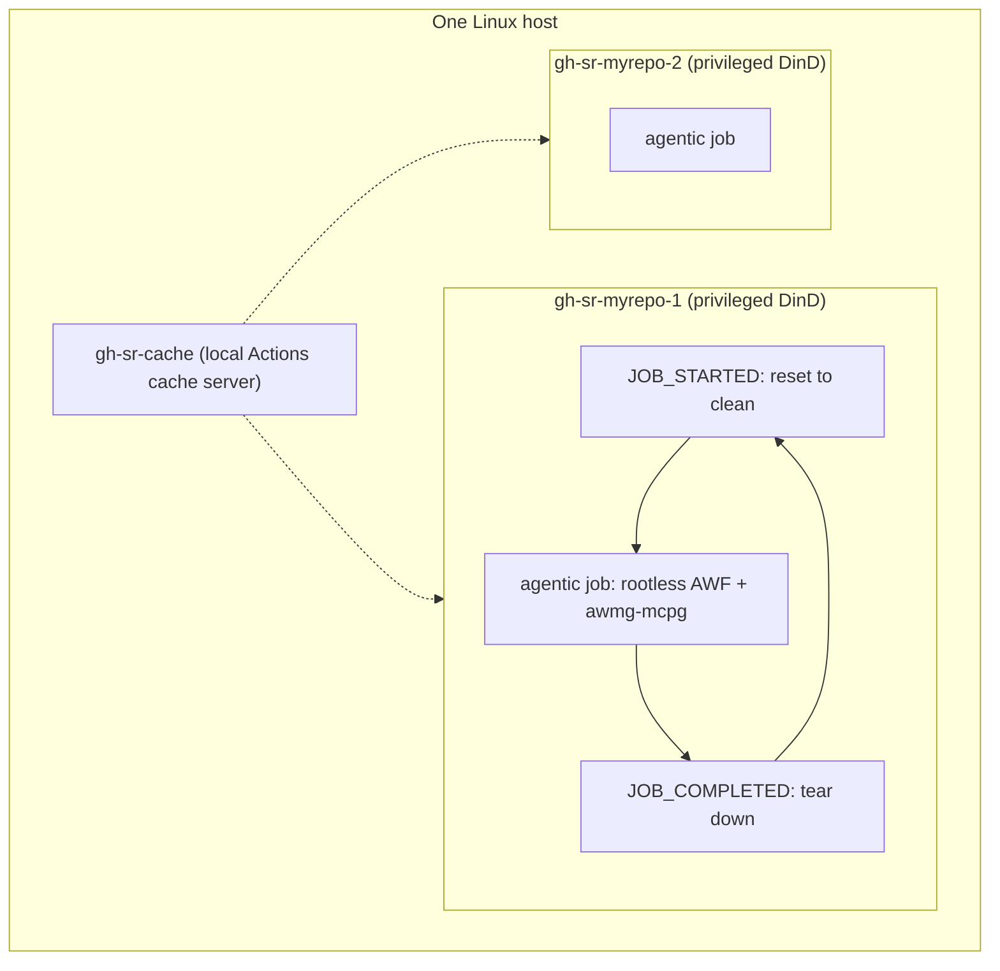

# Running GitHub Agentic Workflows (gh-aw) on self-hosted runners

[GitHub Agentic Workflows](https://github.github.com/gh-aw/) (`gh-aw`) are markdown workflow files compiled to GitHub Actions via `gh aw compile`. They run a live AI agent (Claude, Copilot, Codex, …) inside a sandboxed Docker stack that decides what tools to call and what steps to take.

> **Breaking change (image layout v2):** gh-sr now runs the **gh-aw v0.88+ rootless sandbox** on a fork runner image. Workflows compiled with older gh-aw releases (sudo/iptables sandbox era, `compiler_version < 0.88`) are **not supported** — recompile with `gh extension upgrade gh-aw && gh aw compile` (or run `gh sr doctor --check-lockfiles` to have doctor flag stale lock files).

## 1. Why agentic runners use container mode

gh-aw was designed for **GitHub-hosted runners**, where every job gets a fresh, single-tenant VM. Each compiled workflow hardcodes machine-global resources:

- the runtime tree **`/tmp/gh-aw`** (~80 references per workflow, including a `-v /tmp/gh-aw:/tmp/gh-aw:rw` mount and a `rm -rf /tmp/gh-aw` during setup),
- **fixed container names** for the MCP gateway and sandbox (`awmg-mcpg`, `awf-*`) and the shared `awf-net` bridge,
- shared `$HOME` engine state (`~/.copilot`, `~/.claude`) and the Docker socket.

If several agentic jobs share one host, these collide. To make concurrent agentic runners stable on a single machine, **`gh sr` runs every `profile: agentic` runner in container mode**: each runner instance is a privileged Docker-in-Docker (DinD) container with its **own** inner `dockerd`, network namespace, `/tmp/gh-aw`, and `$HOME` — so the fixed names and ports never leave each container.

> **`profile: agentic` always implies `runner_mode: container`.** `gh sr` rejects `profile: agentic` with `runner_mode: native`, because native mode cannot isolate the resources above.

### Rootless sandbox, GitHub-hosted equivalence

gh-aw v0.88+ runs its firewall **rootless** (default `docker` runtime profile): the AWF agent, Squid proxy, and api-proxy run as unprivileged containers on the **inner bridge topology** (`awf-net` + Squid), with no `sudo`, no `iptables` manipulation, and no `NET_ADMIN`. gh-aw job containers reach the MCP gateway through the bridge and the standard `--add-host=host.docker.internal:host-gateway` mapping — exactly the environment of a GitHub-hosted VM, where the runner filesystem **is** the Docker daemon's filesystem.

That is the property the DinD container provides: the actions runner and the inner `dockerd` share one filesystem and one network namespace, so gh-aw's compiled steps (gateway on `--network bridge` with `127.0.0.1` port mapping, socket mount, `host-gateway` alias) behave identically to GitHub-hosted.

> **`services:` containers are the one exception** — the agent cannot reach them through `host.docker.internal` on this topology. Under network isolation the agent sits on the internal `awf-net` bridge with no route to the runner host, and the gh-aw-documented `services:` + `docker-sudo-iptables` host-access path only works on GitHub-hosted VM runners (it relies on host iptables that topology mode never programs; see gh-aw#52140, gh-aw-firewall#7266). Enable the [service bridge](#service-bridge-services-containers-in-the-sandbox) below to give the sandbox native TCP access to `services:` containers.

### Pristine per job

Each long-lived runner container makes the inner environment **pristine before and after every job** via the official Actions runner hooks (`ACTIONS_RUNNER_HOOK_JOB_STARTED` / `ACTIONS_RUNNER_HOOK_JOB_COMPLETED`):

- **before a job** — remove any leftover `awmg-mcpg` / `awf-` / `gh-aw` containers, prune `awf-net` networks, delete `/tmp/gh-aw`, and verify the inner `dockerd` is healthy;
- **after a job** — tear down the gh-aw containers the job created, prune networks, and delete `/tmp/gh-aw`.

The inner Docker **image-layer cache** (`/runner-state/docker-data`) is the only state preserved across jobs (images and volumes are never deleted by the hooks), so resets never re-pull gh-aw's images. This eliminates the entire class of "leftover from a previous/crashed job" failures (stale gateway, orphan sandbox containers) without any timing-based cleanup.


```mermaid
flowchart TD
  subgraph host [One Linux host]
    cache["gh-sr-cache (local Actions cache server)"]
    subgraph slotA ["gh-sr-myrepo-1 (privileged DinD)"]
      hookA1["JOB_STARTED: reset to clean"]
      jobA["agentic job: rootless AWF + awmg-mcpg"]
      hookA2["JOB_COMPLETED: tear down"]
      hookA1 --> jobA --> hookA2 --> hookA1
    end
    subgraph slotB ["gh-sr-myrepo-2 (privileged DinD)"]
      jobB["agentic job"]
    end
    cache -.-> slotA
    cache -.-> slotB
  end
```

## 2. Host requirements

The host runs only the **outer** runner containers, so its requirements are minimal. Everything gh-aw needs (gh-aw CLI, AWF, Node tooling, Docker CE, zstd, browser packages) lives **inside the image** that `gh sr` builds.

| Requirement      | Details                                                                                          |
| ---------------- | ------------------------------------------------------------------------------------------------ |
| **OS**           | Linux only (Ubuntu/Debian recommended). macOS/Windows hosts are not supported for agentic.       |
| **Architecture** | `amd64` or `arm64`                                                                               |
| **Docker**       | Docker Engine installed and running on the host, with the runner user able to run `docker`.      |
| **`--privileged`** | The host must allow privileged containers (required for the inner `dockerd`).                  |

Install Docker on the host:

```bash
sudo apt-get update && sudo apt-get install -y docker.io
sudo systemctl enable --now docker
sudo usermod -aG docker "$USER"   # log out/in (or: newgrp docker)
docker run --rm --privileged alpine echo privileged-ok   # must print privileged-ok
```

That is all the host setup `gh sr` cannot do for you. There is **no** host dnsmasq, `/etc/hosts`, sudoers, or tool-cache configuration to perform — those concerns are handled inside the image.

## 3. Configuration

```yaml
hosts:
  my-linux-host:
    addr: user@192.168.1.10   # or "local"

runners:
  - name: my-agentic
    repo: owner/repo
    host: my-linux-host
    count: 3                  # 3 concurrent agentic jobs, each fully isolated
    profile: agentic          # implies runner_mode: container (DinD)
```

- `count: N` gives N isolated runner containers (`gh-sr-my-agentic-1` … `-N`) — that is your same-host concurrency. No port or label juggling is required.
- Optional extra image packages: set a global `container_runner_image.extra_apt_packages` list (Debian package names) in `runners.yml`; the image tag gains a suffix so Docker rebuilds.
- Reduced-MTU networks (cloud overlay / VPN / nested virt) are handled automatically — `gh sr` detects the host egress MTU and pins the container's inner/outer Docker MTU to it. Override with `container_runner_image.mtu` only when the host NIC hides a smaller path MTU (see §4).

### Pointing workflows at the runner

Workflows must be compiled with **gh-aw >= v0.88**. Frontmatter only needs standard self-hosted targeting:

```yaml
---
on: issues
runs-on: [self-hosted, linux, x64, agentic]
safe-outputs:
  create-issue: {}
---
```

For gh-aw's lightweight agents (`runs-on-slim` / `safe-outputs.runs-on`), point them at the same runner pool — e.g. `runs-on-slim: self-hosted` — so auxiliary jobs also land on gh-sr runners instead of consuming hosted minutes.

After editing frontmatter, recompile and commit the updated `*.lock.yml` files:

```bash
gh extension upgrade gh-aw
gh aw compile
gh sr doctor --check-lockfiles   # optional gate: fails on stale-era lock files
```

### Service bridge: `services:` containers in the sandbox

Agents that run test suites against a database (Postgres, Redis, …) need to reach the workflow's GitHub Actions [`services:`](https://docs.github.com/en/actions/using-containerized-services/about-service-containers) containers. On this runner topology that needs one opt-in:

```yaml
runners:
  - name: my-agentic
    repo: owner/repo
    host: my-linux-host
    profile: agentic
    awf_service_bridge: true   # join each job's services: to the AWF topology network
```

**Why it is needed.** Under gh-aw v0.88+ network isolation the sandboxed agent sits on the internal `awf-net` bridge — its only egress is the Squid HTTP proxy — while the actions runner places `services:` containers on a separate `github_network_<hash>` bridge. The two are unrouted, so the gh-aw-documented `services:` + `host.docker.internal` + `sandbox.agent.runtime: docker-sudo-iptables` pattern is inert here: that path relies on host iptables that topology mode never programs (it only works on GitHub-hosted VM runners — see [gh-aw#51433](https://github.com/github/gh-aw/issues/51433), [gh-aw#52140](https://github.com/github/gh-aw/issues/52140), [gh-aw-firewall#7266](https://github.com/github/gh-aw-firewall/issues/7266)). gh-aw's strict validator also rejects `services:` with published ports unless that runtime is selected.

**What the bridge does.** A per-job waiter (armed by the job-started hook, killed by the job-completed hook, so it never leaks across jobs) waits for the AWF sandbox to create `awf-net`, then joins each of the job's `services:` containers to it with `docker network connect --alias <service-key>` — the same trusted-topology-peer mechanism AWF itself uses for the MCP gateway (`awf-net`'s name is pinned by awf's network policy for exactly this). Docker's embedded DNS, the agent's only resolver, then serves the service keys, and the agent speaks native TCP. This is the pattern proposed upstream in [gh-aw#57988](https://github.com/github/gh-aw/issues/57988); if gh-aw productizes it (e.g. `services.<name>.attach: true`), you can turn the bridge off and let the workflow own the join.

**Writing the workflow.** Declare `services:` **without port mappings** (the agent reaches them over `awf-net`; ports would also be rejected by gh-aw's strict validator under the default runtime) and point environment at the service keys:

```yaml
---
services:
  postgres:
    image: pgvector/pgvector:pg16-trixie
    env:
      POSTGRES_USER: postgres
      POSTGRES_PASSWORD: postgres
    options: >-
      --health-cmd="pg_isready -U postgres"
      --health-interval=10s --health-timeout=5s --health-retries=5
env:
  DATABASE_HOST: postgres   # resolved by the sandbox via awf-net
  RAILS_ENV: test
---
```

Steps that run **on the runner** (e.g. `pre-agent-steps` preparing a schema) cannot resolve the alias; reach the service by its container IP instead — the inner docker host routes to bridge IPs (`docker inspect -f '{{range .NetworkSettings.Networks}}{{.IPAddress}} {{end}}' <container>`).

**Security.** The bridge only ever joins service containers **into** `awf-net` (never the agent into the runner's network — that would bypass the egress firewall). Services gain an interface on the agent's internal network, which has no route out, and keep their original runner-network interface — the same trust already extended by declaring them under `services:`. Logs land in `/tmp/gh-sr-awf-service-bridge.log` inside the runner container.

Applying the setting to existing runners requires recreating their containers (`gh sr rebuild <name>`), and the image gains the new hook automatically on the next `gh sr setup` (the layout revision changes).

## 4. What the runner image provides

`gh sr setup` builds `gh-sr/agentic-runner:<runner-version>` locally. The image **derives from the [falcondev-oss actions-runner fork](https://github.com/falcondev-oss/actions-runner)** (an official actions-runner build patched so `CUSTOM_ACTIONS_RESULTS_URL` redirects cache traffic; override with `container_runner_image.base_image`). On top of that base, the image adds:

- **Docker CE** (the inner `dockerd` for DinD) — the daemon starts exactly once at container boot, with no baked daemon.json beyond an MTU pin when the host needs one. The runner user (uid 1001) is in the base image's `docker` group, so gh-aw's MCP gateway can mount and use `/var/run/docker.sock` without sudo.
- **Node.js LTS** (accelerates first jobs; the compiler still emits its own `setup-node`), **zstd** (actions/cache archives), **gh**, and the `extra_apt_packages` you configure.
- **Tool cache relocation**: `RUNNER_TOOL_CACHE=/home/runner/.toolcache` (an officially supported non-`/opt` path) with an `/opt/hostedtoolcache` symlink, so legacy setup actions keep working while gh-aw's `buildToolCacheMountSettings` mounts the real path read-only into agent sandboxes.
- **Per-job reset hooks** at `/opt/gh-sr/hooks/job-started.sh` and `/opt/gh-sr/hooks/job-completed.sh`, wired via the runner `.env`.
- **Cache wiring**: when the per-host cache server is enabled (default), `CUSTOM_ACTIONS_RESULTS_URL` is injected so `actions/cache` hits the local server (see [Local Actions cache](local-cache.md)).
- **MTU pinning** for hosts whose egress path MTU is below 1500 (cloud overlays like GCP's 1460, VPN/WireGuard, nested virtualisation). At `docker create` time `gh sr` detects the host's primary egress-interface MTU and injects it as `GH_SR_HOST_MTU`; `entrypoint.sh` writes a minimal `daemon.json` (`mtu` only) and pins the outer container's `eth0` — both strictly before the single `dockerd` start. This makes TCP advertise a matching MSS in both directions so large packets fit.

  > **Why this is needed.** When the real host path MTU is smaller and PMTUD is black-holed, small packets pass so connections *open*, but large packets are silently dropped. TLS handshakes then stall and the socket is torn down mid-handshake, surfacing as `Client network socket disconnected before secure TLS connection was established` — exactly how `actions/setup-go` fails on such hosts while the host itself downloads fine. If the host NIC reports 1500 but a deeper tunnel lowers the real path MTU, force it with `container_runner_image.mtu` in `runners.yml` and `gh sr rebuild`.

**What is deliberately gone** (the retired sudo/iptables image): the docker CLI shim, baked `daemon.json` gateway pinning + bundled dnsmasq + `/etc/resolv.conf` rewrite, the `iptables` NAT bypass for workflow `services:`, passwordless `sudo` for the runner user, pre-installed gh-aw CLI / AWF binaries (jobs install what they need), and a `RUNNER_VERSION` build-arg.

## 5. Operations

```bash
gh sr setup                 # build the image (first run), deploy the cache server, create runner containers
gh sr up                    # start runners; waits for each to be ready (inner dockerd up, registered)
gh sr status                # show local + GitHub status, image, and BUILD freshness
gh sr logs my-agentic       # recent logs for an instance
gh sr down                  # stop the runner containers
gh sr rebuild my-agentic    # rebuild the image after a gh-sr or base_image change, restart containers
gh sr remove my-agentic     # deregister from GitHub and remove container + state
gh sr cache status          # local cache server health and storage usage
```

Each instance runs as a Docker container named `gh-sr-<instance>` with `--restart unless-stopped` so any non-explicit exit (crash, OOM, inner runner process shutdown, Docker daemon restart, host reboot) brings the container back automatically, while `docker stop` / `gh sr down` keep it down. The entrypoint caps persistent inner-`dockerd` bootstrap failures with a `bootstrap-failed` marker so a host that cannot start inner `dockerd` does not restart forever. `gh sr up` clears bootstrap failure markers and staggers multi-instance starts to reduce lockstep load spikes. `gh sr up` health-gates startup: it reports a runner as ready only once the container is running, the inner `dockerd` responds, and the actions runner is registered (a slow first boot is a warning, not a failure). `gh sr status` shows `restarting` or `failed` when bootstrap is stuck.

The **BUILD** column in `gh sr status` compares the image's baked layout revision with the one your current `gh sr` expects: `ok` means current, `stale` means run `gh sr rebuild`, `?` means the image predates revision labels. Changing `container_runner_image.base_image`, the pinned fork tag, or the embedded image sources changes the fingerprint — `gh sr rebuild` is what picks it up.

## 6. Health checks (`gh sr doctor`)

For each Linux host with container-mode runners, `gh sr doctor` checks:

- host Docker CLI/daemon and that a short `--privileged` test container runs (required for DinD);
- for each instance: the `gh-sr-<instance>` container exists and is **running**, the **inner `dockerd`** responds, and `.runner` is present (registered);
- for agentic instances (fan-out in a single `docker exec` round-trip):
  - `container-inner-host-docker-internal` — an inner container started with `--add-host=host.docker.internal:host-gateway` resolves the alias to a non-loopback address (how gh-aw job containers reach gateway/services endpoints);
  - `container-node-npm` / `container-zstd` — Node.js LTS, npm, and zstd are on PATH inside the container;
  - `container-docker-socket-user` — the `runner` user can talk to the inner Docker socket (needed by the `awmg-mcpg` gateway);
  - `container-cache-env` (only when the cache is enabled) — `CUSTOM_ACTIONS_RESULTS_URL` is present in the runner `.env`;
  - `container-mtu` (only when the host egress MTU is below 1500) — no Docker interface MTU exceeds the host egress MTU;
  - hygiene: no orphan `awmg-mcpg`/`awf-`/`gh-aw` containers or `awf-net` networks in the inner Docker;
- the **local cache server** (when enabled): deployed, healthy, and not bound to `0.0.0.0` (LAN exposure warning).

With `--check-lockfiles`, doctor additionally scans each scoped repo's compiled `*.lock.yml` files (up to 20 per repo, via the GitHub API) for retired sudo/iptables-era markers (`FAIL`: must recompile) and old `compiler_version` (`WARN`).

```bash
gh sr doctor --host my-linux-host
gh sr doctor --check-lockfiles
```

## 7. State layout

Each runner container bind-mounts `$HOME/.gh-sr/runners/<instance>` at `/runner-state`:

| Path                         | Contents                                                                |
| ---------------------------- | ----------------------------------------------------------------------- |
| `/runner-state/docker-data/` | Inner Docker image-layer cache — **persistent** across jobs/restarts.   |
| `/runner-state/_work/`       | Runner job workspace.                                                    |
| `/runner-state/_temp/`       | `RUNNER_TEMP` (kept off `/tmp` so it never collides with `/tmp/gh-aw`).  |
| `/runner-state/dockerd.log`  | Inner `dockerd` log.                                                     |

The gh-aw runtime tree `/tmp/gh-aw` lives inside the container rootfs and is wiped before/after every job by the reset hooks — it is per-job scratch, never the cache.

### Disk cleanup

When `docker-data` or `_work` grow large (common on busy agentic fleets), use:

```bash
gh sr disk usage
gh sr disk prune --yes              # idle runners only; keeps inner Docker cache (default)
gh sr disk prune --yes --prune-cache # also reclaim docker-data when disk is critical
```

`gh sr disk usage` also reports the per-host cache storage directory (`gh-sr-cache`). See [Commands — Disk usage and cleanup](../commands.md#disk-usage-and-cleanup) for scheduling and orphan cleanup.

## 8. Troubleshooting

| Symptom | Likely cause | Fix |
| ------- | ------------ | --- |
| `gh sr setup` errors: `runner_mode: container is only supported on Linux` | agentic/container runner on a non-Linux host | Use a Linux host. |
| Validation error: `profile: agentic is no longer supported with runner_mode: native` | old config pinned native mode | Remove `runner_mode: native` (agentic uses container automatically) or set `runner_mode: container`. |
| Validation error: `agentic_mcp_ports / agentic_mcp_port_base have been removed` | old per-instance MCP port config | Delete those fields; container mode isolates the port per runner. |
| `docker --privileged` fails on the host | privileged containers blocked (userns-remap, security policy) | Allow privileged containers, or use a Sysbox runtime (see below). |
| Inner `dockerd` not responding / runner not registered | slow first boot or a broken container | `gh sr logs <name>`, then `gh sr doctor`; `gh sr rebuild <name>` if persistent. |
| `mcp_servers` failed to launch / gateway unreachable | inner `host.docker.internal` mapping broken or stale container | `gh sr rebuild <name>`; verify `gh sr doctor` reports `container-inner-host-docker-internal` as OK (`docker exec gh-sr-<instance> docker run --rm --add-host=host.docker.internal:host-gateway alpine getent hosts host.docker.internal`). |
| `awmg-mcpg` gateway cannot access the Docker socket | socket permissions for the `runner` user | `gh sr rebuild <name>` (fork base image puts `runner` in the docker group). `gh sr doctor` reports this as `container-docker-socket-user`. |
| `actions/cache` misses never hit the local server | cache URL not wired into the runner `.env`, or cache server not deployed | `gh sr cache deploy && gh sr up <name>`; `gh sr doctor` reports this as `container-cache-env`. See [Local Actions cache](local-cache.md). |
| `actions/setup-go` / `setup-node` (or any download) fails with `Client network socket disconnected before secure TLS connection was established`, retries, then errors — but the **host** downloads the same URL fine | container MTU (1500) exceeds the host's real egress path MTU (cloud overlay/VPN/nested virt) with PMTUD black-holed | `gh sr rebuild <name>` to pick up MTU pinning (auto-detects the host egress MTU). If the host NIC reports 1500 but a tunnel lowers the real path MTU, set `container_runner_image.mtu: <value>` in `runners.yml` and rebuild. `gh sr doctor` reports a mismatch as `container-mtu`. |
| Agentic workflow fails at `activation` with `npm is not available. Cannot install @actions/artifact package.` | gh-aw activation setup runs before `actions/setup-node` | `gh sr rebuild <name>` so the image includes Node.js LTS/npm. `gh sr doctor` reports this as `container-node-npm`. |
| Job artifacts (tools, caches) missing for legacy actions that hardcode `/opt/hostedtoolcache` | tool cache moved off `/opt` (rootless mount-safe path) | Expected: the image ships an `/opt/hostedtoolcache` symlink to `/home/runner/.toolcache`; rebuild if your image predates layout v2. |
| Agent job fails with sandbox/iptables-era errors, or `gh sr doctor --check-lockfiles` reports FAIL on a `*.lock.yml` | workflow compiled with pre-0.88 gh-aw | `gh extension upgrade gh-aw && gh aw compile`, commit the updated lock files. |

Inspect a running runner:

```bash
docker exec -it gh-sr-<instance> bash
docker info                       # inner dockerd
docker ps                         # agent/AWF containers for the current job
tail -f /runner-state/dockerd.log
```

### Security: `--privileged` and Sysbox

Container-mode runners use `--privileged` because the inner `dockerd` needs full Linux capabilities. This suits trusted infrastructure. For privilege-free DinD, install [Sysbox](https://github.com/nestybox/sysbox) and run the runner container with `--runtime sysbox-runc` instead of `--privileged` (not auto-configured by `gh sr`).

## 9. Migrating from the retired sudo/iptables image (layout v1)

If your host still runs the pre-v2 image (baked dnsmasq, docker shim, AWF-via-sudo):

1. Upgrade gh-aw and recompile every workflow: `gh extension upgrade gh-aw && gh aw compile` (compiler_version must be >= 0.88). Commit the new `*.lock.yml` files.
2. `gh sr rebuild <name>` — the layout-v2 fingerprint differs, so rebuild rebuilds the image on the fork base and recreates the containers. Existing registrations are preserved.
3. Deploy the cache server (automatic with `gh sr setup`/`gh sr up` when `cache.enabled`, default on): `gh sr cache status` to verify.
4. Verify: `gh sr doctor --strict`, then run one agentic workflow end to end.

The historical native-agentic migration (per-instance `agentic_mcp_ports`, `gh-sr-mcp-<port>` labels) is long gone: `profile: agentic` + `runner_mode: native` is rejected, and those config fields are rejected with a migration message.
